# 🤖 Agentic AI Laravel Demo

A Laravel demonstration project showcasing Agentic AI patterns and implementations, presented at [PHPxTKY (PHP Tokyo Meetup) August 2025](https://www.meetup.com/phpxtky/events/309079243/).

## Original Slide
[Slide](https://www.canva.com/design/DAGxeNP6ut8/6Fas-CRCj_T40JWQa7seNQ/view?utm_content=DAGxeNP6ut8&utm_campaign=designshare&utm_medium=link2&utm_source=uniquelinks&utlId=hbd9cbbe4fc)

## 🎯 Overview

This project demonstrates how to implement **Agentic AI** - AI systems that can plan, take actions, observe results, and adapt their behavior accordingly. Unlike traditional AI that provides single responses, Agentic AI can autonomously execute multi-step workflows using available tools.

## 🧠 What is Agentic AI?

Agentic AI follows the **START → PLAN → ACTION → OBSERVE → OUTPUT** pattern:

```mermaid
graph LR
    A[👤 User Input] --> B[🧠 PLAN]
    B --> C[⚡ ACTION]
    C --> D[👀 OBSERVE]
    D --> E{Need More Actions?}
    E -->|Yes| B
    E -->|No| F[📋 OUTPUT]
    F --> A
```



### Traditional AI vs Agentic AI

**Traditional AI**: Single response to input
```
Human: "What's the weather in Tokyo?"
AI: "Sunny, 25°C"
```

**Agentic AI**: Multi-step reasoning and actions
```
1. 🧠 PLAN: "I need to get weather data for Tokyo"
2. ⚡ ACTION: Call getWeatherDetails("Tokyo") 
3. 👀 OBSERVE: "Sunny, 25°C"
4. 📋 OUTPUT: "The weather in Tokyo is sunny with a temperature of 25°C"
```

## 🚀 Demo Applications

### 1. Weather AI Agent (`app:weather-ai`)

A simple agentic AI that provides weather information:

**Features:**
- Plan-driven weather queries
- Tool-based weather data retrieval
- Multi-city comparisons
- Conversational interface

**Usage:**
```bash
php artisan app:weather-ai
```

**Available Cities:** Tokyo, Osaka, New York (hardcoded demo data)

### 2. Todo CRUD AI Agent (`app:todo-ai`)

An intelligent todo management system with full CRUD capabilities:

**Features:**
- Create, read, update, delete todos
- Search functionality
- Intelligent conversation flow
- Database integration

**Usage:**
```bash
php artisan app:todo-ai
```

## 🏗️ Architecture

### State Machine Pattern

Both agents implement a consistent state machine:


### JSON Response Format

All AI responses follow a structured JSON format:

```json
{
  "type": "action",
  "function": "getWeatherDetails", 
  "input": "Tokyo"
}
```

**Response Types:**
- `plan` - AI planning step
- `action` - Tool execution
- `output` - Final response to user

## 📁 Project Structure

```
app/Console/Commands/
├── WeatherAi.php          # Weather agent implementation
└── TodoCrudAi.php         # Todo CRUD agent implementation

config/prompts/
├── weather-ai.php         # Weather agent system prompt
└── todo-ai.php           # Todo agent system prompt

app/Tools/
└── TodoCrudTool.php      # Todo operations tool

presentation/
├── agentic-ai-presentation.md
├── agentic-ai-presentation-new.md
└── agentic-ai-presentation-laravel.md
```

## ⚙️ Setup & Installation

1. **Clone the repository**
```bash
git clone https://github.com/puncoz/agentic-ai-laravel.git
cd agentic-ai-laravel
```

2. **Install dependencies**
```bash
composer install
```

3. **Environment setup**
```bash
cp .env.example .env
php artisan key:generate
```

4. **Configure OpenAI**
Add your OpenAI API key to `.env`:
```env
OPENAI_API_KEY=your-api-key-here
```

5. **Database setup** (for Todo agent)
```bash
php artisan migrate
```

## 🛠️ Technical Implementation

### Core Components

1. **Command Classes** - Laravel Artisan commands that handle user interaction
2. **Tool Classes** - Encapsulated functionality that agents can use
3. **Prompt Configs** - System prompts that define agent behavior
4. **Auto-prompting Loop** - Handles the continuous AI conversation flow

### Key Features

- **JSON-structured responses** for reliable parsing
- **Tool validation** and error handling
- **Conversation state management**
- **Dynamic prompt injection** with tool information
- **Multi-turn conversations** with memory

## 🎪 Live Demo Examples

### Weather Agent Flow
```
User: "What's the weather like in Tokyo and New York?"

AI PLAN: "I need to get weather for both cities"
AI ACTION: getWeatherDetails("Tokyo")
AI OBSERVE: "Sunny, 25°C"
AI PLAN: "Now I need New York weather"  
AI ACTION: getWeatherDetails("New York")
AI OBSERVE: "Rainy, 18°C"
AI OUTPUT: "Tokyo: Sunny 25°C, New York: Rainy 18°C. Tokyo is 7°C warmer!"
```

### Todo Agent Flow
```
User: "Add a todo to buy groceries"

AI PLAN: "User wants to create a todo"
AI OUTPUT: "What specific groceries do you need?"
User: "Milk, bread, and eggs"
AI PLAN: "Now I can create a specific todo"
AI ACTION: createTodo("Buy milk, bread, and eggs")
AI OBSERVE: "Todo created with ID: 1"
AI OUTPUT: "✅ Added todo: 'Buy milk, bread, and eggs' (ID: 1)"
```

## 🔧 Extending the System

### Adding New Tools

1. Create a tool method in your agent or tool class:
```php
public function newTool($input): string 
{
    // Tool implementation
    return "Tool result";
}
```

2. Register in the tools array:
```php
$tools = [
    'existingTool' => 'Description',
    'newTool' => 'New tool description',
];
```

3. Update system prompts to include the new tool

### Creating New Agents

1. Create a new Command class extending `Illuminate\Console\Command`
2. Implement the `autoPrompting` method
3. Define available tools and their descriptions
4. Create a corresponding prompt configuration

## 📚 Resources

- **OpenAI Function Calling**: [Documentation](https://platform.openai.com/docs/guides/function-calling)
- **ReAct Pattern**: The academic foundation for this implementation
- **Laravel Artisan**: [Commands Documentation](https://laravel.com/docs/artisan)

## 🎯 Key Takeaways

1. **Agentic AI = AI + Planning + Tools** - Not just responses, but actions
2. **State Machines Provide Structure** - Clear flow makes debugging easier  
3. **Tools Define Capabilities** - Your AI is only as good as its tools
4. **Conversation Flow Matters** - Know when to ask vs. act
5. **Error Handling is Critical** - Graceful failures improve user experience

## 🚀 Presented At

**PHPxTKY (PHP Tokyo Meetup) - August 2025**

**Title**: Replacing Business Logic with Agentic AI: Building Adaptive and Intelligent Laravel Applications

**Meetup Link**: https://www.meetup.com/phpxtky/events/309079243/

## 🤝 Contributing

Feel free to explore, experiment, and extend this demo! The code is designed to be educational and easily modifiable.

## 📄 License

This project is open-source and available under the MIT License.
